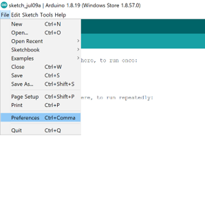
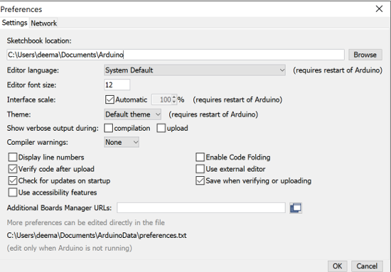
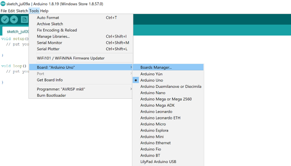
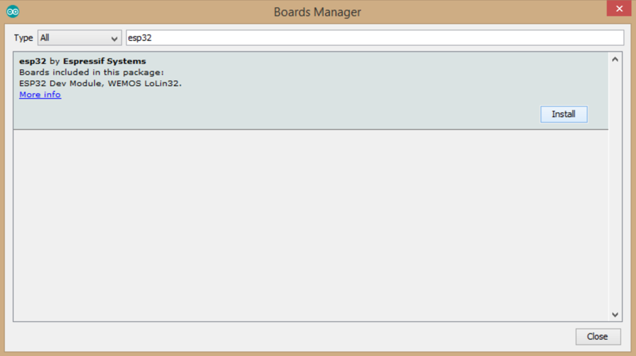
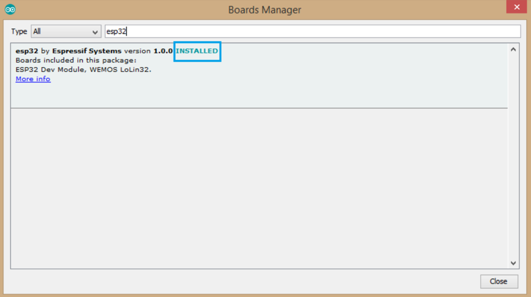
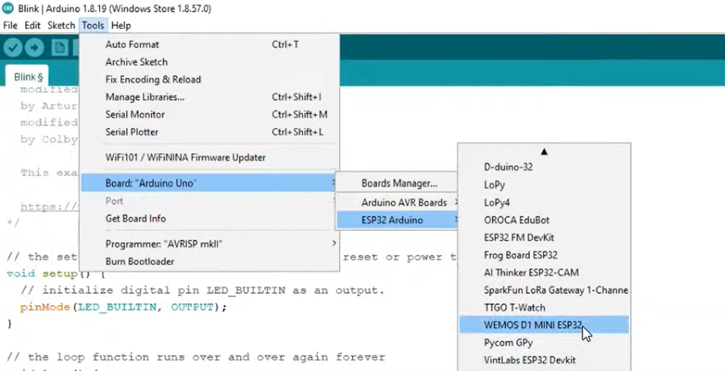
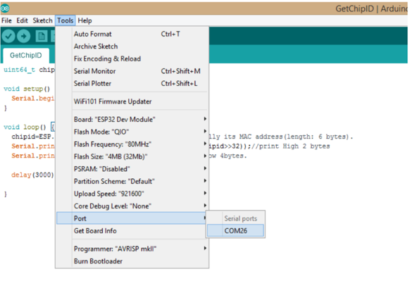
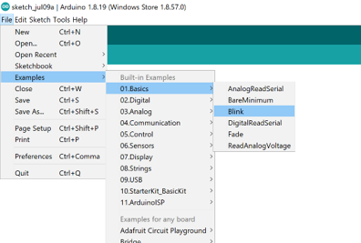
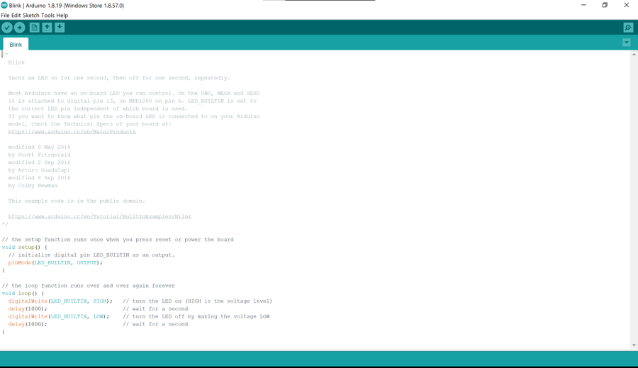

# What is Wasdom ESP32?
ESP32 is a series of low-cost, low-power system on a chip microcontrollers with integrated Wi-Fi and dual-mode Bluetooth

# Wasdom ESP32 Link Steps

To perform the following steps correctly, a connection to the Internet is required!

    1.Install Arduino IDE from: https://www.arduino.cc/en/software

    2.Connect Wasdom ESP32 to your laptop via USB cable.

    3.Open Arduino IDE and go to File > Preference.
  
  
    4.The Preference dialog box will appear, then paste the following URL into 'Additional Board Manager URLs' and press OK. 
   https://dl.espressif.com/dl/package_esp32_index.json
   
   

    5.Go to Tools > Board > Board Manager.
   

    6.The Board Manager dialog box will appear, search for "ESP32" and press "Install", wait for the installation to complete and press "Close".
   
   

    7.Go to Tools > Board and scroll down, there you will see a complete category with different esp32 boards. Select "WEMOS D1 MINI ESP32" or any other board depending on the one you are using. 

    8.Go to Tools > Port and select the available port in the list and then upload the code. 
   
    
        -After this step, the Wasdom ESP32 is ready to use, but it is important to check if the linking steps were done successfully or not!

    9.Go to File > Examples > Basics > Blink
   
   
    The following window appears to upload the code to Wasdom ESP32, press the arrow
  

    If the link was successful, the light will flash on and off several times!!
